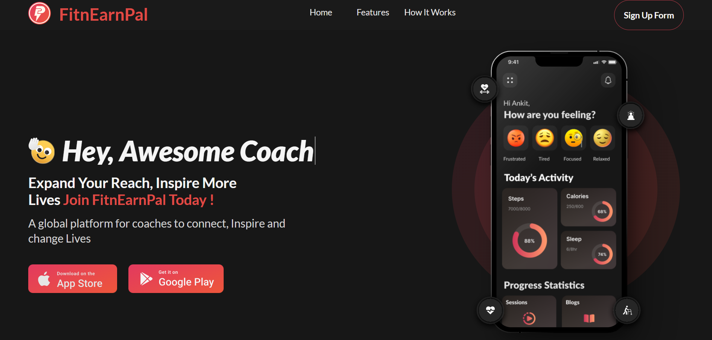

# 🏋️‍♂️ FitnEarnPal

Welcome to the **FitnEarnPal** – an elegant, interactive and modern web template designed for fitness brands, gyms, trainers, and health startups. Built with **React.js** and **Tailwind CSS**, this project delivers a visually stunning introduction to your business that’s fast, responsive, and easy to customize.

---

## ✨ Features

- **🎨 Modern UI/UX**  
  Minimal, clean, and professional design for instant impact.

- **⚡ Fast & Lightweight**  
  Optimized for performance using React + Tailwind CSS.

- **🖼️ Hero Section with Typing Animation**  
  Dynamic intro text for maximum engagement.

- **🎥 Interactive Hover Animations**  
  Smooth, playful effects on buttons and elements.

- **🎭 Grayscale-to-Color Card Hover**  
  Stylish card transitions to showcase features/services.

- **🖱️ Smooth Scrolling Navigation**  
  Effortless page transitions for a premium experience.

---

## 🛠️ Tech Stack

- **Frontend:** React.js, Tailwind CSS, TypeScript
- **Animations:** CSS transitions, Typing effects, Hover effects

---

## 📸 Screenshots

| Hero Section (Typing Effect) |
|:----------------------------:|
|  |

---

## ⚙️ Installation & Setup

1. **Clone the repository**
   ```bash
   git clone https://github.com/mansoor015/FitnEarnPal
   cd FitnEarnPal
   ```

2. **Install dependencies**
   ```bash
   npm install
   ```

3. **Run the project locally**
   ```bash
   npm run dev
   ```

4. **Open in your browser**
   ```
   http://localhost:5173
   ```

---

## 📁 Folder Structure

```
FitnEarnPal/
├── public/          # Static assets
├── src/
│   ├── assets/      # Images, icons
│   ├── App.tsx       # Main app component
│   └── index.html     # Entry point
└── package.json
```

---

## 💡 Customization

- Update images in `src/assets/`
- Add or modify components in `src`
- Change color palette via Tailwind config

---

**Impress your users from the very first scroll – get started with the FitnEarnPal today!**